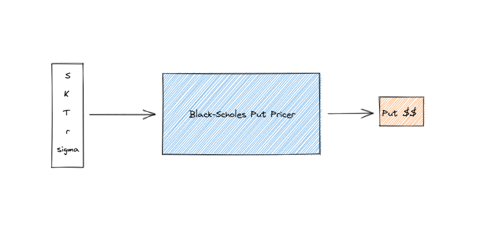

# Riskfuel Problem Set 


## Introduction

This problem set consists of training a deep neural network to approximate the analytic Black-Scholes price of a European Put option. The neural net will be evaluated on a validation set defined on a closed domain of input parameters. Your goal is to obtain the best model performance (ie. Mean and Maximum Squared Error). 


## Black-Scholes Model 

The Black-Scholes Model was concieved by McMaster alumni Myron Scholes and his co-author Fischer Black. From Black-Scholes, one can derive an analytic solution to a European Put option, the solution has been provided to you in `utils/black_scholes.py`. The pricer takes in the following variables: 

- Underlying stock price (S) 
- Strike price (K)
- Time to maturity (T)
- Risk free interest rate (r) 
- Volatility (sigma)

Which then outputs the following price: 

- Price of put option in dollars (value) 

Essentially it is a function which takes in 5 inputs, and returns 1 output. 





## Domains
The domain on which the model will be validated on. 

```python
S_bound = [0.0, 200.0]
K_bound = [50.0, 150.0] 
T_bound = [0.0, 5.0]
r_bound = [0.001, 0.05]
sigma_bound = [0.05, 1.5]

```

There is a file called `dataset.py` that will assist you in generating a training/validation set. 

## Constraints/Requirements 

The `riskfuel_test.py` file has validation code describing how each team will be evaluated. We must be able to download your git repo, run `pip install -r requirements.txt`, and then run 

```bash 
python riskfuel_test.py --data_frame_name <validation.csv>
```   

The output should look something like this: 

```python 
 ============ Evaluating Team: Riskfuel ========================= 
 Members :
 Nikola Pocuca
 Maxime Bergeron
 ================================================================ 

 MODEL PERFORMANCE: 45.183143615722656 

```

The validation code will be checked manually for all teams. 

### *Do not use the analytic pricer as part of your model. This is considered cheating and you will be automatically disqualified.* 

You are free to use any packages/frameworks you like provided that they can be run and installed on a `ubuntu 20.04` docker image found here `https://hub.docker.com/_/ubuntu`. When writing code to evaluate your model, feel free to delete the skeleton code within `riskfuel_test.py`. 

## Recommendations 

Pytorch is a great framework for training ML models that has options for CPU training. Pytorch also allows you to implicity define gradients in an interpretive fashion as opposed to other frameworks such as Tensorflow. 

We whole-heartedly advocate Pytorch for this problem set `https://pytorch.org/` over other packages. You will NOT be penalized for not using Pytorch if you are more comfortable with other packages. 

Some files have been provided for you to start, they are missing some basic ML techniques but provide an overall basis for how to train BSMs. They are given as 
`demo.py`, and `dataset.py`. 


